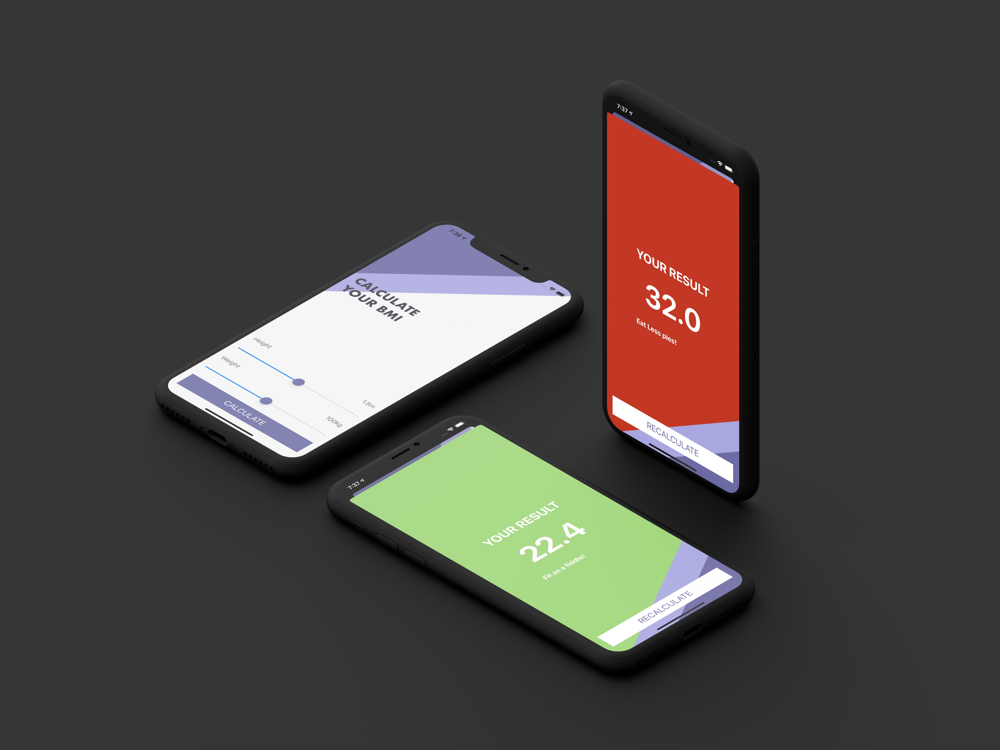

<!-- PROJECT LOGO -->
 

   
  <h2 align="center">BMICalculator</h2>

  Calculate a user BMI and give some advice back relative to the results.

 

### Technologies Used

`Swift 5`

### Architecture Used

`MVC`
